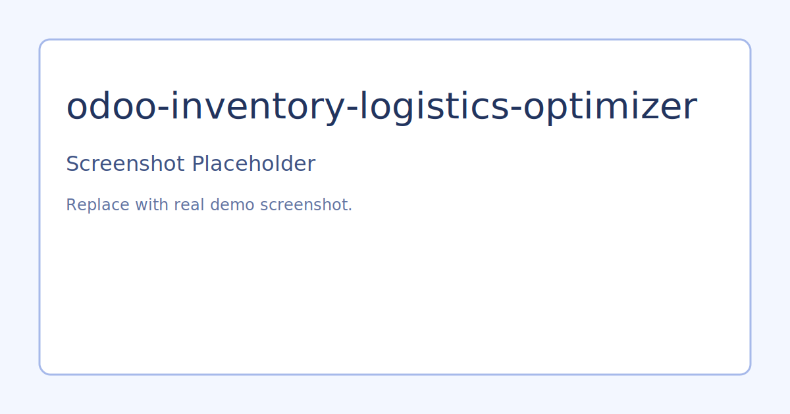

# Odoo Inventory and Logistics Optimizer

## Problem
Warehouse teams lose productivity when pickings are not grouped by practical movement patterns. During seasonal peaks, reservation and dispatch delays escalate.

## Solution
This project adds wave grouping heuristics for stock pickings to reduce picker travel and improve dispatch readiness.

## What It Demonstrates
- Grouping of pickings by source location
- Wave chunking for operationally manageable batch sizes
- KPI doc template for measuring warehouse impact
- Functional test scaffold

## Architecture
- `addons/stock_route_optimizer/models/stock_picking.py`
- `addons/stock_route_optimizer/tests/test_wave_grouping.py`
- `docs/kpi_tracking.md`

## Demo Flow
1. Install addon in an Odoo environment with Inventory.
2. Prepare a set of test pickings across multiple source locations.
3. Run `group_pickings_for_wave` and inspect generated waves.
4. Compare baseline and optimized KPIs in `docs/kpi_tracking.md`.

## Portfolio Talking Points
- Heuristic vs exact route optimization tradeoffs.
- How batching strategy impacts team throughput.
- KPI selection for logistics-focused stakeholders.

## Screenshots

Replace ssets/screenshots/placeholder.svg with real screenshots from your Odoo demo environment.

